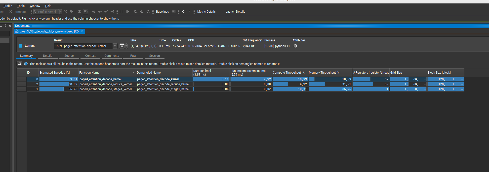
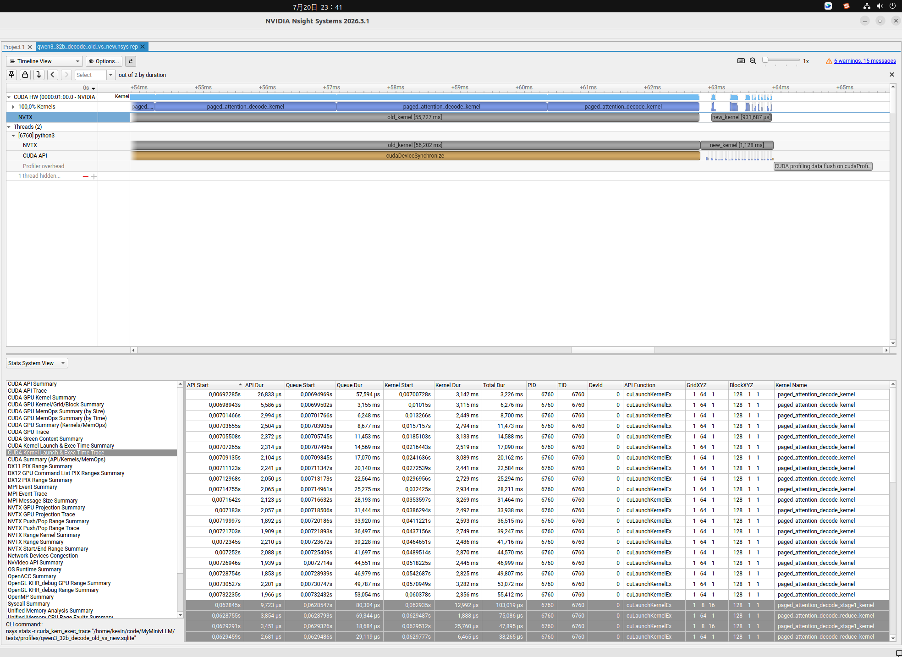

# 摘要 — Commit ID 区间：[`dcff99f`](https://github.com/KevinWu8192/MinivLLM/commit/dcff99f3b791a230eddc447b0519583bf6c209e5) → [`f71bd44`](https://github.com/KevinWu8192/MinivLLM/commit/f71bd443275e6f0b1ddfa3e482fa34e160ef92a9)

**Tag：** [`release-6`](https://github.com/KevinWu8192/MinivLLM/tree/release-6)

本次 Release 为下一个 Release 准备 Decode Attention 基础。下一个 Release 将加入 Qwen3-32B 的单机多 GPU 部署，并以此验证张量并行（TP）以及整套推理框架中的 Prefill/Decode 调度、KV Cache、CUDA Graph 和多 Rank 执行路径。Release 6 首先消除大模型 Decode Kernel 瓶颈：在隔离的 Qwen3-32B Decode Attention 基准测试中，新 Kernel 相比原实现取得约 **75× 的 Kernel 级性能提升**。

优化实现有意作为 `attention_large_scale.py` 引入，而不是直接替换默认的 `attention.py`。这样既能保留可复现的旧/新对照，也为下一步端到端接入 Qwen3-32B 提供一个受控的新 Kernel。

## 主要修复

### 1. 消除按 Query Head 串行执行的 Decode 瓶颈

**涉及文件**

* `src/myvllm/layers/attention.py`
* `src/myvllm/layers/attention_large_scale.py`

**问题**

* 原始启动 Grid 是 `(batch_size, num_heads)`。Qwen3-32B 在 Batch 1 下仅启动 64 个 Triton Program，而且每个 Program 都要串行遍历完整 KV Context。长上下文 Decode 因此没有足够的独立工作来占满 GPU。([原始代码](https://github.com/KevinWu8192/MinivLLM/blob/25ce870d2319b387133fd5680fa0fc95cd10b2a8/src/myvllm/layers/attention.py#L475-L528))
* Qwen3-32B 使用 GQA，八个 Query Head 共享一个 KV Head，但旧 Program 按单个 Query Head 分配。同一份 K/V 数据因此被八个不同 Program 重复加载和处理，无法在 Query 分组内复用。([原始代码](https://github.com/KevinWu8192/MinivLLM/blob/25ce870d2319b387133fd5680fa0fc95cd10b2a8/src/myvllm/layers/attention.py#L363-L424))
* QK 和 PV 都通过 `BLOCK_N` 上的标量循环表达：Kernel 每次加载一个 K 向量、归约 `q * k`、向 `qk` 插入一个分数，然后再进行第二个标量循环，逐个提取概率并累加一个 V 向量。这使两个主要矩阵乘法无法使用分块 `tl.dot` 和对 Tensor Core 友好的 MMA Shape。([原始代码](https://github.com/KevinWu8192/MinivLLM/blob/25ce870d2319b387133fd5680fa0fc95cd10b2a8/src/myvllm/layers/attention.py#L397-L465))

**示例**

基准测试模拟 Qwen3-32B Decode：`batch_size = 1`、`context_len = 4096`、`num_heads = 64`、`num_kv_heads = 8`、`head_dim = 128`、`BLOCK_N = 32`，输入为 FP16。旧 Grid 只有 64 个 Program；每个 Program 负责一个 Query Head，并遍历全部 128 个 N Tile。同属一个 KV Head 的 Program 会各自重复加载相同 K/V Tile，共计八次。

**修复**

* Stage 1 Grid 改为 `(batch_size, num_kv_heads, num_splits)`。每个 Program 负责一个 `(batch, KV Head, context split)` 元组，使长 Context 能在 N 方向暴露并行度，而不是全部串行留在单个 Program 内。([修复](https://github.com/KevinWu8192/MinivLLM/blob/dcff99f3b791a230eddc447b0519583bf6c209e5/src/myvllm/layers/attention_large_scale.py#L344-L387))
* 共享同一 KV Head 的全部 Query Head 被加载成一个 Q 分组。Qwen3-32B 的逻辑分组为 `[8, 128]`，随后补齐为适配 MMA 的 `[16, 128]` Tile，补齐行在 load/store 时被 Mask。一个 K Tile 因而可由八个真实 Query Head 共同复用。([修复](https://github.com/KevinWu8192/MinivLLM/blob/dcff99f3b791a230eddc447b0519583bf6c209e5/src/myvllm/layers/attention_large_scale.py#L388-L408))
* 一个 N Tile 中 32 个 Token 的分页 K/V 地址会被同时转换。QK 变为 `[16, 128] @ [128, 32]` 上的 `tl.dot(q, k)`，PV 变为 `[16, 32] @ [32, 128]` 上的 `tl.dot(p, v)`；原有在线 Softmax 状态 `m_i`、`l_i` 和 `acc` 在 Tile 间保持不变。([修复](https://github.com/KevinWu8192/MinivLLM/blob/dcff99f3b791a230eddc447b0519583bf6c209e5/src/myvllm/layers/attention_large_scale.py#L410-L455))

### 2. Split-KV 并行与数值稳定的归约

**涉及文件**

* `src/myvllm/layers/attention_large_scale.py`

**问题**

* 原 Kernel 没有 Context Split 维度，因此 `context_len` 增长只会增加每个 Query-Head Program 内部的串行工作量，不会扩大启动 Grid。对于没有 Batch 并行度的 Batch-1 自回归 Decode，这一点尤其低效。([原始代码](https://github.com/KevinWu8192/MinivLLM/blob/25ce870d2319b387133fd5680fa0fc95cd10b2a8/src/myvllm/layers/attention.py#L382-L465))
* 分割后的 Context 不能通过平均各 Split 独立归一化的 Attention Output 来合并。每个 Split 具有不同的最大 Logit 和指数分母；丢弃这些统计量会改变全局 Softmax 结果。原始单 Program 实现没有 Partial State 表示，也没有 Reduction 路径。([原始代码](https://github.com/KevinWu8192/MinivLLM/blob/25ce870d2319b387133fd5680fa0fc95cd10b2a8/src/myvllm/layers/attention.py#L429-L472))

**示例**

对于 Qwen3-32B 基准 Shape，`4096 / BLOCK_N = 128` 个 N Tile，`_choose_decode_num_splits()` 选择 16 个 Split。Stage 1 因此启动 `1 × 8 × 16 = 128` 个 Program。每个 Program 处理一段连续的完整 32-Token Tile，并为其八个真实 Query Head 分别产生一份 `(m_s, l_s, acc_s)` 状态。

**修复**

* Context 按 N Tile 而不是任意 Token 边界切分。`num_n_tiles`、`tiles_per_split`、`split_tile_start` 和 `split_tile_end` 将每个完整的 `BLOCK_N = 32` Tile 唯一分配给一个 Split，最后一个 Tile 再 Mask 掉超出 `context_len` 的 Token。([修复](https://github.com/KevinWu8192/MinivLLM/blob/dcff99f3b791a230eddc447b0519583bf6c209e5/src/myvllm/layers/attention_large_scale.py#L381-L425))
* Stage 1 将未归一化的在线 Softmax 状态写入 Workspace：`m_i/l_i` 的 Shape 为 `[batch, query_head, split]`，`acc` 的 Shape 为 `[batch, query_head, split, head_dim]`。让 Split 维相邻，可使每个 Reduction Program 读取同一 Query Head 的全部状态。([修复](https://github.com/KevinWu8192/MinivLLM/blob/dcff99f3b791a230eddc447b0519583bf6c209e5/src/myvllm/layers/attention_large_scale.py#L457-L473))
* Reduction 精确重建全局在线 Softmax：先计算 `m = max_s(m_s)`，再用 `exp(m_s - m)` 重标定每个 Split，得到 `l = Σ_s exp(m_s - m) l_s` 和 `acc = Σ_s exp(m_s - m) acc_s`，最终写入 `acc / l`。空 Split 满足 `l_s = 0`，不会产生贡献。([修复](https://github.com/KevinWu8192/MinivLLM/blob/dcff99f3b791a230eddc447b0519583bf6c209e5/src/myvllm/layers/attention_large_scale.py#L490-L552))
* `_choose_decode_num_splits()` 使用可用 Tile 数、最多 32 个 Split 和 Stage 1 目标 128 个 Program 共同限制 N 方向并行度。该决策只依赖启动时 Shape，不依赖运行时 `context_lens`，因此 CUDA Graph Capture 时 Grid 保持稳定。当 `num_splits == 1` 时，Stage 1 直接将归一化结果写入 `output`，避免 Partial Workspace 和 Reduction Launch。([修复](https://github.com/KevinWu8192/MinivLLM/blob/dcff99f3b791a230eddc447b0519583bf6c209e5/src/myvllm/layers/attention_large_scale.py#L555-L695))

### 3. 新 Decode Kernel 运行逻辑

```text
                         Decode Q [B, 64, 128]
                                  │
                         按共享 KV Head 分组 Q Head
                                  │
                                  ▼
                   每个 KV Head 的逻辑 Q_group [8, 128]
                       为 MMA 补齐成 Q tile [16, 128]
                                  │
                         将 Context 划分为对齐的
                           BLOCK_N = 32 Tile
                                  │
              ┌───────────────────┼───────────────────┐
              ▼                   ▼                   ▼
           N split 0           N split 1          N split S-1
              │                   │                   │
        分页 K/V 地址转换     分页 K/V 地址转换     分页 K/V 地址转换
              │                   │                   │
       分块 QKᵀ / Softmax   分块 QKᵀ / Softmax   分块 QKᵀ / Softmax
         / tl.dot 计算 PV      / tl.dot 计算 PV      / tl.dot 计算 PV
              │                   │                   │
        m₀, l₀, acc₀        m₁, l₁, acc₁        mₛ, lₛ, accₛ
              └───────────────────┼───────────────────┘
                                  ▼
                        log-sum-exp 状态归约
                    m = max(mₛ)，重标定 lₛ 与 accₛ
                                  │
                                  ▼
                    最终 Attention Output [B, 64, 128]
```

当 `S = 1` 时会跳过 Reduction Stage，由 Stage 1 直接写出归一化结果。

### 4. 可复现的正确性、Benchmark、NCU 与 NSYS 分析

**涉及文件**

* `tests/test_attention_large_scale_decode.py`
* `releases/release-6-ncu.png`
* `releases/release-6-nsys.png`

**修复**

* 新增确定性的 CUDA 驱动，构造物理 Block 不连续的 Block Table，并针对短、长 Context 将优化 Kernel 与 PyTorch Reference 对比；它还会针对 Qwen3-32B 基准 Shape 单独比较新旧 Kernel，预热后使用 CUDA Event 计时，并通过 NVTX Range 与 CUDA Profiler 控制支持 NCU/NSYS 抓取。([修复](https://github.com/KevinWu8192/MinivLLM/blob/f71bd443275e6f0b1ddfa3e482fa34e160ef92a9/tests/test_attention_large_scale_decode.py#L1-L221))

使用以下命令运行已提交的测试驱动：

```bash
uv run python tests/test_attention_large_scale_decode.py --mode correctness
uv run python tests/test_attention_large_scale_decode.py --mode benchmark
uv run python tests/test_attention_large_scale_decode.py --mode profile --iterations 1
```

在 NVIDIA GeForce RTX 4070 Ti SUPER 上，NCU 对比显示原 Kernel 约为 3.11 ms，新 Stage-1 Kernel 约为 0.04 ms，Reduction 作为耗时小得多的独立 Kernel 展示。对于被分析的 Qwen3-32B Shape，这对应约 **75× 的 Kernel 级 Decode 性能提升**。



NSYS Timeline 也显示，原串行 Kernel 占据很长的连续时间段，而新路径的 Stage 1 与 Reduction Launch 在短得多的区间内完成。NSYS Range Duration 包含 Launch、同步与 Profiler 开销，因此它用于提供 Timeline 佐证，而不是 75× 纯 Kernel 数字的来源。



## 验证

已提交的测试驱动包含 Context Length `[1, 17, 31]` 和 `[2049, 4093]` 的 PyTorch Reference 检查，误差阈值为 `atol=2e-2, rtol=2e-2`；同时还包含 Qwen3-32B Shape `batch=1, context=4096, Q/KV=64/8, head_dim=128, fp16` 的新旧 Kernel 对比。随附的 NCU 与 NSYS 截图记录了隔离 Decode Kernel 约 75× 的性能提升。本次文档更新未在本机重新运行 CUDA 测试，因为当前环境没有支持 CUDA 的 PyTorch/Triton Runtime。Qwen3-32B 单机多 GPU TP 执行和端到端调度验证按计划留到下一个 Release。
